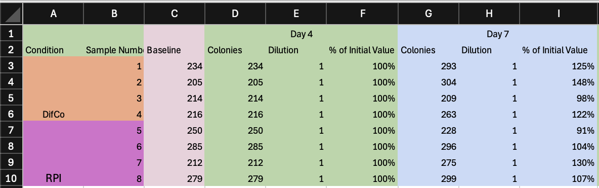

# Data Entry Automator

## About
The data entry automator is a tool that allows you to automate the process of entering experimental lifespan data into spreadsheets in the format necessary to generate meaningful graphs and statistical tests.

## Usage

The program can currently be run from either the command line or via a GUI. 

### Running the Program
#### Not Recommended
Run the program using the following command:
```bash
java -jar data-entry-automator.jar -i <input file> [options]
```
##### Options

| Argument        | Short Form | Usage                  | Description                                                   | Default Value                         |
|-----------------|------------|------------------------|---------------------------------------------------------------|---------------------------------------|
| `--input`       | `-i`       | `--input <filepath>`   | Input file name (required)                                    | NONE                                  |
| `--output-type` | `-t`       | `--output-type <TYPE>` | Output type (`PRISM`, `OTHER`, `RAW`, `BOTH`)                 | `BOTH`                                |
| `--mode`        | `-m`       | `--mode <MODE>`        | Mode (`GENERATE_OUTPUT_SHEETS`, `GENERATE_EMPTY_INPUT_SHEET`) | `GENERATE_OUTPUT_SHEETS`              |
| `--different`   | `-d`       | `--different`          | Write to a different file than the specified input file       | `false`                               |
| `--output`      | `-o`       | `--output <filepath>`  | Output file name                                              | `"Spreadsheet Formatter Output.xlsx"` |
| `--verbose`     | `-v`       | `--verbose`            | Whether or not verbose output should be printed               | `false`                               |
| `--help`        | `-h`       | `--help`               | Whether or not helpful usage information should be printed    | `false`                               |


#### Recommended
Run the program by installing the app using one of releases on the [releases](https://github.com/AdamW78/Data-Entry-Automator/releases) page. Once installed, navigate to the installation location (or create a desktop shortcut) and open the application to access the GUI. The program should look something like:


### Input
The input to the data entry automator is a `.xlsx` file with the following columns:
- `Strain`: The name of the strain
  - - only one of Condition or Strain is required, though both can be used
- `Condition`: The condition of the strain
  - only one of Condition or Strain is required, though both can be used
- `Sample Number`: The number of the sample
- Multiple `Day XX` 3-column groups, where `XX` is the day number
  - `Colonies`: The day number
  - `Dilution`: Whether the sample was diluted by a factor of 10x, 100x, or 1000x
    - 1000x is represented by 1
    - 100x is represented by 0.1
    - 10x is represented by 0.01
  - `% of initial value`: The number of worms dead on that day
- `Baseline` (optional): The number of  alive at the start of the experiment

> #### Example Input File
> 
> An example of a valid input file is shown below:
> 
>
>
> In the above example, only the `Condition`, `Sample Number`, `Baseline`, and `Day XX` columns are used.
> 
> The `Strain` column is excluded in the example, but the `Condition` column is present, so it is okay. The file would be fine with a `Condition` and `Strain` column or just a `Strain` column, but it would not be valid with neither.
